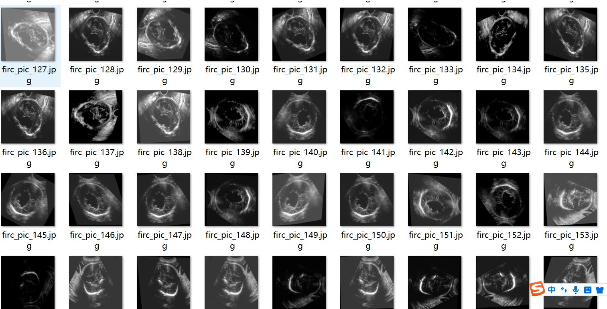
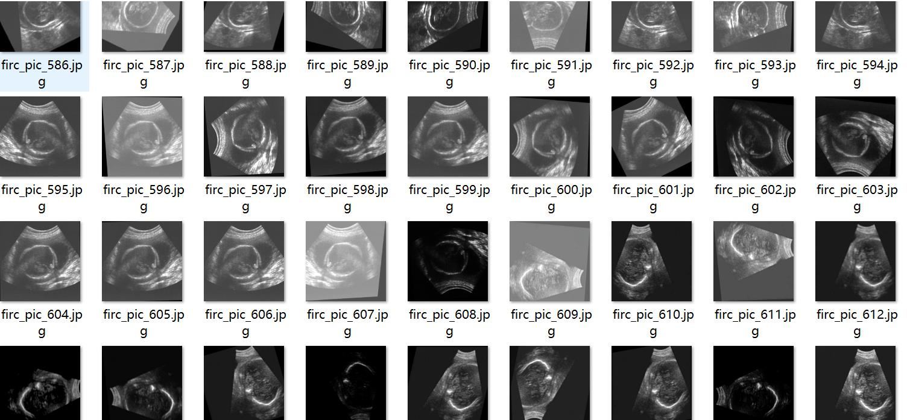
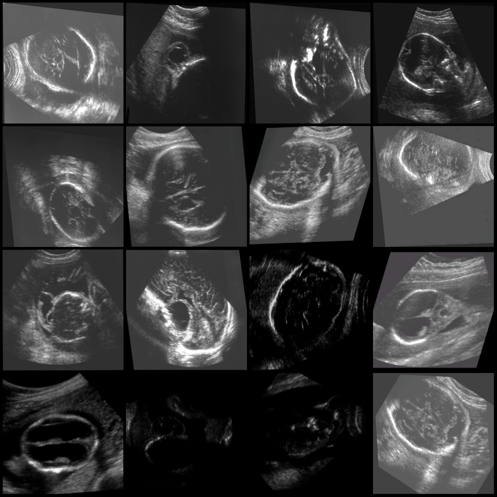
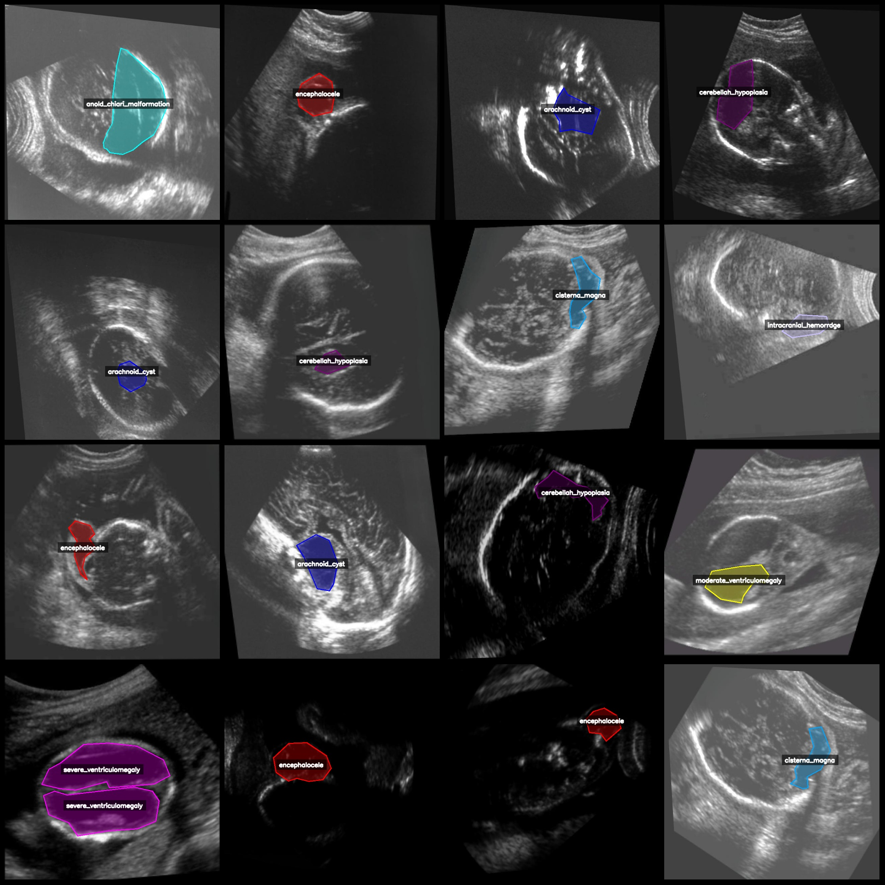
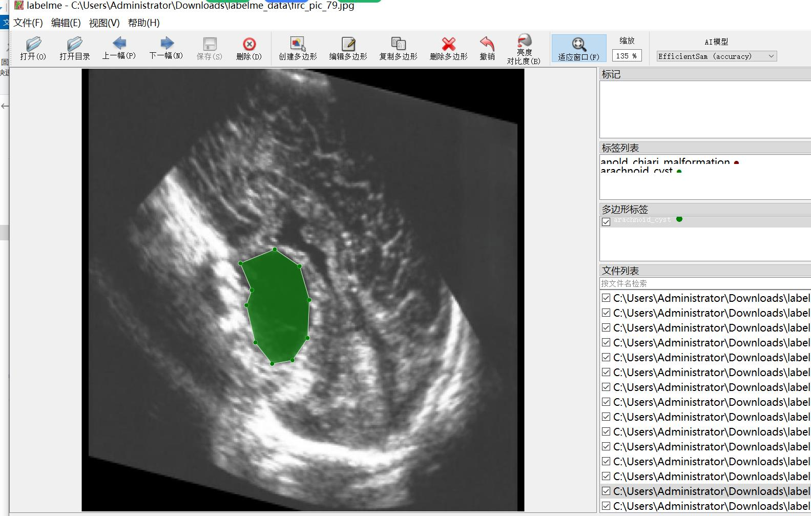

# Intelligent Healthcare Brain Abnormality Compute-Aided Segmentation Dataset LabelMe Format with 1391 Images and 14 Categories

Please be aware that there are numerous enhancements in the dataset, which is roughly at a 1:9 ratio. This means that the original images are less than 200. You can see the image below for more details.
Dataset format: labelme format (without mask files, only containing jpg images and corresponding json files)  
Number of images (number of jpg files): 1391  
Number of annotations (number of json files): 1391  
Number of annotation categories: 14  
Annotation category names: ["anold_chiari_malformation","arachnoid_cyst","cerebellah_hypoplasia","cisterna_magna","colphocephaly","encephalocele","holoprosencephaly","hydracenphaly","intracranial_hemorrdge"]
"intracranial_tumor","mild_ventriculomegaly","moderate_ventriculomegaly","polencephaly","severe_ventriculomegaly"]  
boxes per class:   
Arnold-Chiari malformation count = 46  
Arachnoid cyst count = 122  
Cerebellar hypoplasia count = 114  
Cisterna magna count = 40
Colpocephaly (Brain-Sac Softening/Lateral Brain Swelling) count = 92
The count of encephaloceles (brain hernias) is 162.
Hydrocephalic encephalocele
Hydracenphaly (hydrocephalus) count = 26
Intracranial hemorrhage (intracranial hemorrhage) count = 64
Intracranial tumor (intracranial tumor) count = 14
Mild ventriculomegaly (mild ventriculomegaly) count = 285
Moderate ventriculomegaly (moderate ventriculomegaly) count = 272
Polencephaly (polycephaly) count = 104
Severe ventriculomegaly (severe ventriculomegaly) count = 137
total boxes: 1490  
The annotation tool "labelme" version 5.5.0 is used for labeling and annotating text data.
image resolution: 640x640  
Annotation rule: Draw a polygon outline around the class.
Important Notice: The dataset can be opened and edited using labelme. For JSON datasets, they need to be converted into mask or yolo format or coco format for semantic segmentation or instance segmentation.
Special Notice: This dataset does not guarantee the accuracy of the trained model or weight files.
image preview:
Example:  

1. Markdown example:
```
# Example
```

2. Translate to English:
```
Example
```
Original image (randomly selected 16 images):  
Annotation drawing result:
LabelMe Editor Instance:
## Images







Here is a pay link on Stripe ( https://buy.stripe.com/3cs8yP7sY87d0vu9AB ). Please contact me lonlonago@foxmail.com after funding $89, and I will send you a complete data files , thank you!

